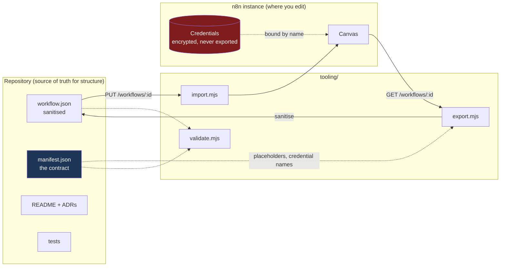
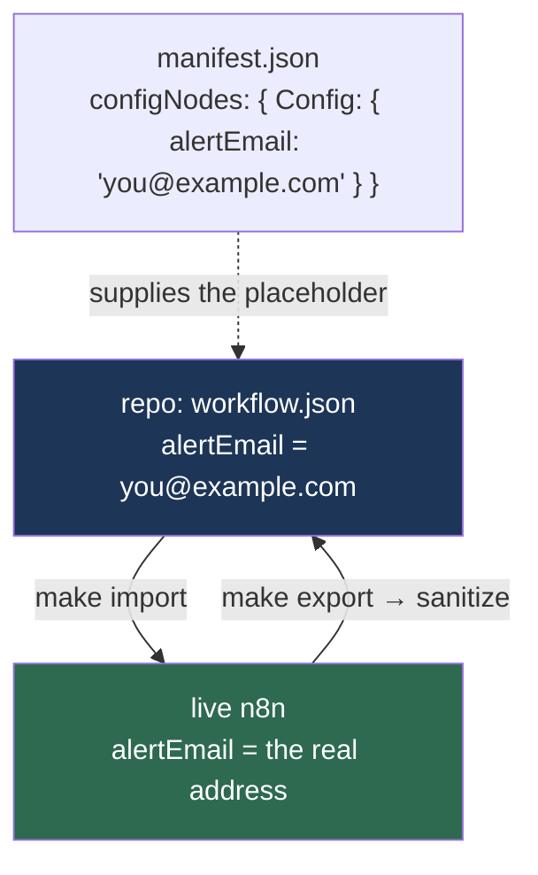

# Architecture

How the repository, the tooling and the running n8n instance fit together.

## Three moving parts



The repository owns **structure and documentation**. The n8n instance owns
**secrets and live configuration**. Neither is a full backup of the other, and that
split is deliberate: it is what lets the repo be public.

## The manifest is the seam

Every tool is generic because it reads `manifest.json` instead of knowing anything
about a particular workflow:

| Field                       | Consumed by        | Purpose                                     |
| --------------------------- | ------------------ | ------------------------------------------- |
| `n8nId`                     | export, import     | Which workflow to fetch or overwrite        |
| `credentials[]`             | validate, import   | Parity check; tells the user what to create |
| `configNodes`               | sanitize, validate | Which node fields to placeholder            |
| `status`, `trigger`, `tags` | gen-readme         | The index table                             |
| `slug`                      | discovery          | Must equal the directory name               |

Adding a workflow therefore touches no script and no CI file. Discovery walks
`workflows/*/manifest.json` and everything downstream follows.

## Export: what gets removed and why

`tooling/lib/sanitize.mjs` runs on every export. Nothing here is optional cleanup —
each removal fixes a specific way a naive export breaks or leaks.

| Removed                                                | Why                                                                                                                                                                                            |
| ------------------------------------------------------ | ---------------------------------------------------------------------------------------------------------------------------------------------------------------------------------------------- |
| `credentials[].id`                                     | Points at a row in _this_ instance's database. Keeping it means a fresh instance binds to nothing and the node imports unconfigured. Dropping it promotes the **name** to a portable contract. |
| `shared`                                               | Embeds the owning project, whose name contains the owner's email address. The single most likely PII leak.                                                                                     |
| `staticData`                                           | Polling cursors (`lastTimeChecked`). Replaying another instance's cursor makes a new instance skip mail it never saw.                                                                          |
| `id`, `versionId`, `versionCounter`, `versionMetadata` | Instance-local identity and history.                                                                                                                                                           |
| `webhookId`                                            | Regenerated by n8n on import.                                                                                                                                                                  |
| `pinData`                                              | Test fixtures pinned in the editor; not part of the definition.                                                                                                                                |
| `active`, `triggerCount`, `updatedAt`, …               | Runtime state, not structure. Also the reason a diff would churn on every export.                                                                                                              |
| `meta.instanceId`                                      | Identifies the exporting machine.                                                                                                                                                              |
| Config node values                                     | Rewritten to the manifest's placeholders.                                                                                                                                                      |

Then keys are sorted recursively and the file is written as 2-space JSON with a
trailing newline.

### Two import paths, one of which needs an id

Stripping `id` has a consequence worth knowing, because it is invisible until you
hit it:

| Path                                        | Needs `id`? | Why                                                                          |
| ------------------------------------------- | ----------- | ---------------------------------------------------------------------------- |
| `POST /workflows` — what `make import` uses | No          | The API generates one                                                        |
| `n8n import:workflow` — the CLI             | **Yes**     | Inserts straight into the database, where `workflow_entity.id` is `NOT NULL` |

So the committed JSON imports cleanly through the API and fails through the CLI
with `SQLITE_CONSTRAINT: NOT NULL constraint failed: workflow_entity.id`. The CI
smoke test therefore injects a throwaway id before invoking the CLI: what is
under test is the document's shape, not its identity.

If you import by hand, prefer `make import`.

**Determinism matters more than it sounds.** Without sorted keys, the n8n API
returning fields in a different order would rewrite the file on every export,
burying real changes in noise. A test asserts the committed file equals
`sanitize(parse(file))` byte for byte, so an empty `git diff` after `make export`
is a meaningful signal.

## Configuration flow



Import carries placeholders in; the user edits them on the canvas; export rewrites
them back out. The live value never has a path into the repository, even if someone
forgets it is there. The reason configuration lives in a node rather than `$env` is
[ADR-0004](adr/0004-config-node-over-env-vars.md).

## Test layering

| Layer               | Location                        | Scope                         | Grows with                         |
| ------------------- | ------------------------------- | ----------------------------- | ---------------------------------- |
| Shared invariants   | `tooling/tests/shared.test.mjs` | Every workflow, automatically | Nothing — generated from discovery |
| Workflow invariants | `workflows/<slug>/tests/`       | One workflow's decisions      | One file per project               |

The shared layer asserts properties that must hold for anything in the repo:
valid schema, no dangling connections, no PII, no credential ids, no `$env`,
placeholder parity, export determinism, LF endings.

The per-workflow layer asserts _decisions_. The rule is one assertion per ADR — an
ADR that a future edit could silently undo needs a test, or the reasoning decays
into a document nobody reads.

The clearest example is graph-based rather than textual:

```js
everySlotReaches(workflow.connections, 'Route by Category', 'Mark as Processed');
```

This walks all four router outputs and proves each reaches the terminator. A regex
over the JSON could not express it, and it survives refactors that move nodes
around. It exists because the failure it prevents — a branch that never marks the
email read, so the trigger reprocesses it every minute forever — is silent,
expensive, and easy to introduce by adding a branch.

## Runtime

One n8n container, image pinned. SQLite by default; a Postgres overlay adds
healthcheck-gated startup and resource limits for anything long-lived.

Two things are load-bearing and easy to get wrong:

- **`N8N_ENCRYPTION_KEY`** must be set explicitly. Unset, n8n generates one into
  `data/config`, making that file the only copy of the key that decrypts every
  stored credential.
- **`GENERIC_TIMEZONE`** must be set. n8n defaults to `America/New_York`, which
  silently shifts every cron trigger and every `$now` in an expression.

Both are covered in [OPERATIONS.md](OPERATIONS.md).
