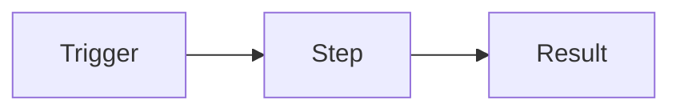

# **NAME**

> One-line summary of what this workflow does.

**Status:** draft · **Trigger:** TODO

## What it does

Describe the flow in plain language, in the order it happens. A reader should
understand the behaviour without opening n8n.

## Diagram



## Configuration

Values live in the **Config** node on the canvas, not in environment variables
(see [ADR-0004](../../docs/adr/0004-config-node-over-env-vars.md)). Edit them in
n8n after importing. The repo copy always holds placeholders.

| Field | Placeholder | What to set it to |
| ----- | ----------- | ----------------- |
| —     | —           | —                 |

## Credentials

| Credential | Type | Name to create in n8n | How to obtain |
| ---------- | ---- | --------------------- | ------------- |
| —          | —    | —                     | —             |

Credentials bind **by name**, so create them with exactly the names above and
`make import` wires them up automatically.

## Nodes

| Node | Type | Purpose |
| ---- | ---- | ------- |
| —    | —    | —       |

## Design decisions

Link the ADRs that explain anything non-obvious. If a reviewer would ask "why is
it done this way?", the answer belongs in an ADR, not a code comment.

## Testing

```bash
make validate
make test
```

Per-workflow invariants live in `tests/invariants.test.mjs`. Add one for every
decision that a future edit could silently undo.

## Troubleshooting

| Symptom | Likely cause | Fix |
| ------- | ------------ | --- |
| —       | —            | —   |
