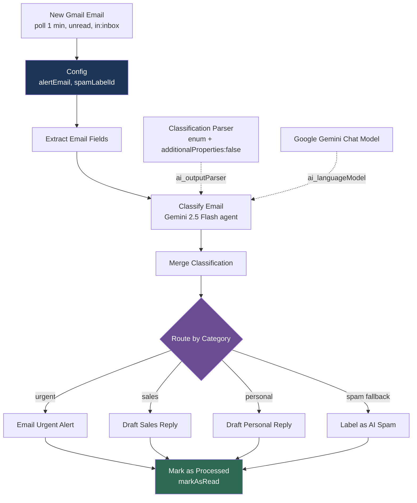
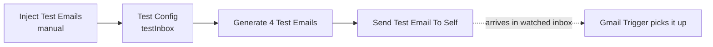

# Email AI Classifier

> Triages incoming Gmail with Google Gemini into **urgent / sales / personal /
> spam**, then alerts, drafts a reply, or labels — and marks each message
> processed so it is never handled twice.

**Status:** 🟢 live · **Trigger:** Gmail poll, every minute · **Nodes:** 20

## What it does

1. **Poll** — the Gmail Trigger checks for unread mail matching `in:inbox`, once
   a minute.
2. **Config** — supplies the two per-account values (alert address, spam label
   id). Everything downstream reads them from here.
3. **Extract** — normalises the Gmail payload into five flat fields, capping the
   body at 4000 characters.
4. **Classify** — a Gemini 2.5 Flash agent returns `category`, `reason` and
   `draft_reply`, constrained by a structured output parser.
5. **Route** — a Switch sends the item down one of four branches.
6. **Act** —
   - `urgent` → email alert to the configured address
   - `sales` / `personal` → **draft** reply in the original Gmail thread (never sent)
   - `spam` → custom `AI/Spam` label; the message **stays in the inbox**
7. **Mark as Processed** — marks the message read, so the next poll cannot pick it
   up again. Every branch ends here.

## Diagram



The test injector is a separate chain on the same canvas:



## Configuration

Values live in the **Config** nodes on the canvas, not in environment variables —
see [ADR-0004](../../docs/adr/0004-config-node-over-env-vars.md) for why. Edit
them in n8n after importing; the repo copy always holds placeholders.

| Node          | Field         | Placeholder                | Set it to                                                          |
| ------------- | ------------- | -------------------------- | ------------------------------------------------------------------ |
| `Config`      | `alertEmail`  | `you@example.com`          | Where urgent alerts are sent                                       |
| `Config`      | `spamLabelId` | `Label_XXXXXXXXXXXXXXXXXX` | Gmail id of your `AI/Spam` label                                   |
| `Test Config` | `testInbox`   | `you@example.com`          | Inbox the test injector sends to — must be one the trigger watches |

### Finding your spam label id

Gmail label ids are per-account, so the one in this repo is a placeholder.

1. In Gmail, create a label — `AI/Spam` is the convention here.
2. On the canvas, enable **Bootstrap: List Gmail Labels** and execute just that
   node. It returns every label with its id.
3. Copy the id into `Config.spamLabelId`, then disable the bootstrap node again.

## Credentials

Credentials bind **by name**. Create them with exactly these names and
`make import` wires them up automatically — no per-node clicking.

| Type            | Name to create                    | Used by                     | How to obtain                                                      |
| --------------- | --------------------------------- | --------------------------- | ------------------------------------------------------------------ |
| `gmailOAuth2`   | `Gmail account`                   | Trigger + all 8 Gmail nodes | [Google Cloud OAuth setup](../../docs/CREDENTIALS.md#gmail-oauth2) |
| `googlePalmApi` | `Google Gemini(PaLM) Api account` | Chat model                  | [aistudio.google.com/apikey](https://aistudio.google.com/apikey)   |

Required Gmail scopes: `gmail.modify`, `gmail.compose`, `gmail.labels`.
See [docs/CREDENTIALS.md](../../docs/CREDENTIALS.md) for the full walkthrough.

## Nodes

| Node                                         | Type                                    | Purpose                                                      |
| -------------------------------------------- | --------------------------------------- | ------------------------------------------------------------ |
| New Gmail Email                              | `gmailTrigger`                          | Polls unread inbox mail every minute, `simple: false`        |
| Config                                       | `set`                                   | Per-account values; passes the payload through               |
| Extract Email Fields                         | `set`                                   | Flattens to `emailId`, `threadId`, `from`, `subject`, `body` |
| Classify Email                               | `langchain.agent`                       | Classification + draft generation                            |
| Google Gemini Chat Model                     | `lmChatGoogleGemini`                    | `models/gemini-2.5-flash`                                    |
| Classification Parser                        | `outputParserStructured`                | Enum contract, `autoFix` on                                  |
| Merge Classification                         | `set`                                   | Rejoins email fields with the model's verdict                |
| Route by Category                            | `switch`                                | 3 rules + spam fallback                                      |
| Email Urgent Alert                           | `gmail`                                 | Sends the alert                                              |
| Draft Sales Reply                            | `gmail`                                 | Threaded draft                                               |
| Draft Personal Reply                         | `gmail`                                 | Threaded draft                                               |
| Label as AI Spam                             | `gmail`                                 | `addLabels`, non-destructive                                 |
| Mark as Processed                            | `gmail`                                 | `markAsRead` — terminal on all branches                      |
| Bootstrap: List Gmail Labels                 | `gmail`                                 | Disabled helper for label discovery                          |
| Inject Test Emails → Send Test Email To Self | `manualTrigger`, `set`, `code`, `gmail` | End-to-end test harness                                      |

## Design decisions

| ADR                                                      | Decision                                                                                                                 |
| -------------------------------------------------------- | ------------------------------------------------------------------------------------------------------------------------ |
| [0001](docs/adr/0001-custom-ai-spam-label.md)            | Custom `AI/Spam` label, never Gmail's system SPAM — a false positive would hide real mail _and_ train Gmail's own filter |
| [0002](docs/adr/0002-mark-as-processed-at-branch-end.md) | Mark read last on every branch, so a failure retries instead of vanishing                                                |
| [0003](docs/adr/0003-gemini-2-5-flash.md)                | `gemini-2.5-flash` — the 2.0 series has no usable free-tier quota                                                        |
| [0004](../../docs/adr/0004-config-node-over-env-vars.md) | Config node instead of `$env`, which n8n 2.0 blocks by default                                                           |

Prompt design and the reasoning behind each edge-case rule:
[docs/prompt-engineering.md](docs/prompt-engineering.md).

## Testing

```bash
make validate                            # schema, manifest, placeholders, PII
make test                                # shared invariants + the ones below
```

`tests/invariants.test.mjs` encodes the ADRs as assertions. The one that earns its
keep walks the connection graph and proves **every** output of `Route by Category`
reaches `Mark as Processed` — add a fifth branch without a terminator and the build
fails rather than the workflow quietly reprocessing the same email every minute.

End-to-end, against real Gmail: click **Inject Test Emails**. It sends the four
fixture emails to `Test Config.testInbox`; the live trigger picks them up and you
can watch all four route correctly.

## Troubleshooting

| Symptom                               | Likely cause                                                               | Fix                                                                                        |
| ------------------------------------- | -------------------------------------------------------------------------- | ------------------------------------------------------------------------------------------ |
| Same email processed repeatedly       | A branch does not reach `Mark as Processed`                                | Run `make test` — the graph invariant names the branch                                     |
| `access to env vars denied`           | Workflow was edited to use `$env`                                          | Use the Config node instead ([ADR-0004](../../docs/adr/0004-config-node-over-env-vars.md)) |
| All fields empty downstream           | Trigger set to `simple: true`, or `Config` has `includeOtherFields: false` | Both are asserted by tests; run `make test`                                                |
| Label step fails with `invalid label` | `spamLabelId` is still the placeholder                                     | Run the bootstrap node, paste the real id                                                  |
| Gemini 429 / quota errors             | Model changed to the 2.0 series                                            | Revert to `gemini-2.5-flash` ([ADR-0003](docs/adr/0003-gemini-2-5-flash.md))               |
| Alerts never arrive                   | `alertEmail` is still the placeholder                                      | Set it in the Config node                                                                  |
| Nothing triggers at all               | Workflow inactive, or n8n was off                                          | n8n must be running for the poll to fire — it is not a cloud cron                          |
