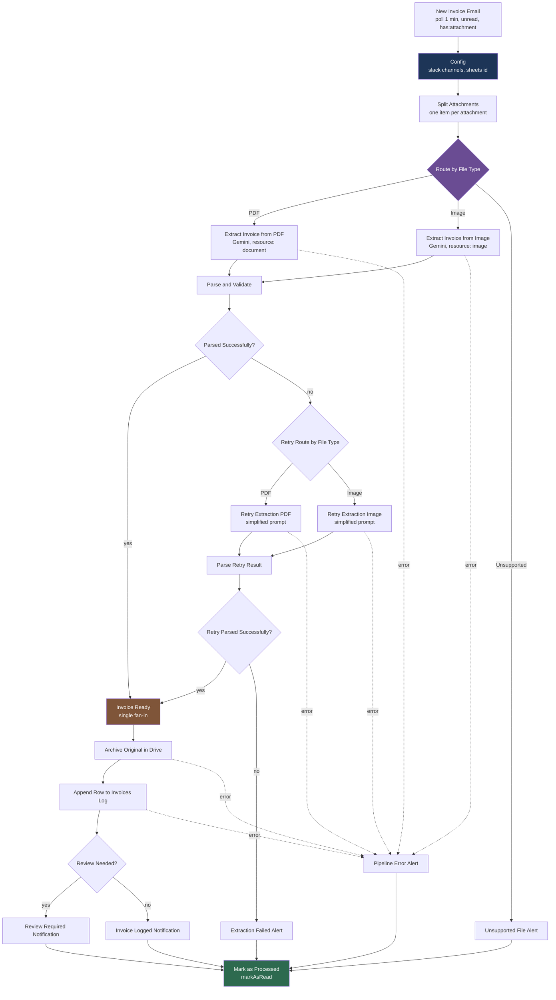
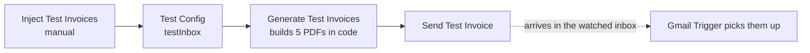

# Invoice / Receipt Extractor

> Watches Gmail for invoice and receipt attachments, reads them with Google
> Gemini, checks that the totals add up, archives the original in Drive, appends
> a row to a Sheets log, and tells Slack — flagging anything doubtful instead of
> dropping it.

**Status:** 🟢 live · **Trigger:** Gmail poll, every minute · **Nodes:** 32

## What it does

1. **Poll** — the Gmail Trigger looks for unread mail matching
   `has:attachment (invoice OR receipt OR fature OR fatura OR fattura OR rechnung)`,
   once a minute, with the attachments downloaded.
2. **Config** — supplies the three per-installation values (two Slack channels,
   the Sheets document id). Everything downstream reads them from here, so it sits
   in front of _every_ branch, including the error ones.
3. **Split Attachments** — fans one item out per attachment and tags each `pdf`,
   `image` or `unsupported` from its MIME type.
4. **Route by File Type** — three ways: PDF, image, or an alert for anything else.
5. **Extract** — Gemini 2.5 Flash. PDF and image go to _different nodes_ because
   the node exposes them as different resources (`document` vs `image`).
6. **Parse and Validate** — strips code fences, parses the JSON, checks
   `subtotal + tax ≈ total`, and decides `needs_review`.
7. **Retry once** — a failed parse is re-sent with a deliberately simpler prompt.
   Fail twice and the item is alerted, with no row written.
8. **Store** — archive the original in Drive, then append one row to the Invoices
   Log with the Drive link.
9. **Notify** — flagged rows go to the alerts channel with the reason and the file
   link; clean rows go to the invoices channel.
10. **Mark as Processed** — marks the message read. Every branch ends here, so no
    email is ever picked up twice.

## Diagram



The test injector is a separate chain on the same canvas:



## Configuration

Values live in the **Config** nodes on the canvas, not in environment variables —
see [ADR-0004](../../docs/adr/0004-config-node-over-env-vars.md) for why. Edit them
in n8n after importing; the repo copy always holds placeholders.

| Node          | Field                  | Placeholder       | Set it to                                                     |
| ------------- | ---------------------- | ----------------- | ------------------------------------------------------------- |
| `Config`      | `slackChannelInvoices` | `C0XXXXXXXXX`     | Channel id for successfully logged invoices                   |
| `Config`      | `slackChannelAlerts`   | `C0XXXXXXXXX`     | Channel id for review, failure and error alerts               |
| `Config`      | `sheetsDocumentId`     | `1XXXXXXXX…`      | Spreadsheet id of your Invoices Log                           |
| `Test Config` | `testInbox`            | `you@example.com` | Inbox the injector sends to — must be one the trigger watches |

> **Do not remove `stripBinary: false` from `Config`.** A `Set` node with
> `includeOtherFields: true` drops binary data by default, which empties every
> attachment two nodes into the pipeline — with no error anywhere.
> [ADR-0003](docs/adr/0003-config-node-must-not-strip-binary.md).

### Finding the ids

- **Slack channel id** — right-click the channel → _View channel details_; the id
  (`C…`) is at the bottom. Channel _names_ are not used: they are renameable, ids
  are not.
- **Sheets document id** — the segment between `/d/` and `/edit` in the
  spreadsheet URL.

### Preparing the Invoices Log

Create a spreadsheet whose first sheet has a header row with these columns, in
any order — the append node maps by name:

```
vendor_name, vendor_tax_id, invoice_number, invoice_date, due_date, currency,
line_items, subtotal, tax_amount, tax_rate, total_amount, payment_terms,
confidence_score, source_email, file_name, processed_at, file_link, attempt,
math_ok, needs_review
```

Filter on `needs_review = TRUE` to get the review queue. `file_link` is the Drive
URL of the archived original, so a reviewer can open the document from the row.
The full `validation_note` is not a column — it goes to the Slack alert, which is
where a flagged row is actually acted on.

## Credentials

Credentials bind **by name**. Create them with exactly these names and
`make import` wires them up automatically.

| Type                    | Name to create                    | Used by                         | How to obtain                                                      |
| ----------------------- | --------------------------------- | ------------------------------- | ------------------------------------------------------------------ |
| `gmailOAuth2`           | `Gmail account`                   | Trigger, mark read, test sender | [Google Cloud OAuth setup](../../docs/CREDENTIALS.md#gmail-oauth2) |
| `googlePalmApi`         | `Google Gemini(PaLM) Api account` | 4 extraction nodes              | [aistudio.google.com/apikey](https://aistudio.google.com/apikey)   |
| `googleDriveOAuth2Api`  | `Google Drive account`            | Archive Original in Drive       | Google Cloud OAuth, Drive scope                                    |
| `googleSheetsOAuth2Api` | `Google Sheets account`           | Append Row to Invoices Log      | Google Cloud OAuth, Sheets scope                                   |
| `slackOAuth2Api`        | `Slack account`                   | 5 notification nodes            | Slack app with `chat:write`                                        |

> The author's own instance calls the Slack credential something else; the
> manifest declares that as `liveName` and export rewrites it, so `Slack account`
> is the only name you need. See
> [ADR-0005](../../docs/adr/0005-credential-export-aliases.md).

Required Gmail scopes: `gmail.modify`, `gmail.compose`.
See [docs/CREDENTIALS.md](../../docs/CREDENTIALS.md) for the full walkthrough.

## Nodes

| Node                                                                                | Type                                    | Purpose                                                          |
| ----------------------------------------------------------------------------------- | --------------------------------------- | ---------------------------------------------------------------- |
| New Invoice Email                                                                   | `gmailTrigger`                          | Polls unread mail with attachments every minute, `simple: false` |
| Config                                                                              | `set`                                   | Per-installation values; `stripBinary: false` keeps attachments  |
| Split Attachments                                                                   | `code`                                  | One item per attachment; tags `pdf` / `image` / `unsupported`    |
| Route by File Type                                                                  | `switch`                                | 2 rules + an `Unsupported` fallback                              |
| Extract Invoice from PDF / Image                                                    | `googleGemini`                          | `models/gemini-2.5-flash`, `document` and `image` resources      |
| Parse and Validate                                                                  | `code`                                  | Fence-stripping parser, arithmetic check, `needs_review`         |
| Parsed Successfully?                                                                | `if`                                    | Routes a failed parse into the retry chain                       |
| Retry Route by File Type                                                            | `switch`                                | Re-dispatch by type, no fallback                                 |
| Retry Extraction PDF / Image                                                        | `googleGemini`                          | Second pass, simplified prompt                                   |
| Parse Retry Result                                                                  | `code`                                  | Same parser, `attempt: 2`                                        |
| Retry Parsed Successfully?                                                          | `if`                                    | Second failure → alert, no row                                   |
| Invoice Ready                                                                       | `noOp`                                  | Single fan-in; every later expression reads from here            |
| Archive Original in Drive                                                           | `googleDrive`                           | Uploads the attachment, returns `webViewLink`                    |
| Append Row to Invoices Log                                                          | `googleSheets`                          | `append`, mapped by column name                                  |
| Review Needed?                                                                      | `if`                                    | Splits flagged from clean rows                                   |
| Unsupported / Extraction Failed / Review Required / Invoice Logged / Pipeline Error | `slack`                                 | The five terminal notifications                                  |
| Mark as Processed                                                                   | `gmail`                                 | `markAsRead` — terminal on all five branches                     |
| Inject Test Invoices → Send Test Invoice                                            | `manualTrigger`, `set`, `code`, `gmail` | End-to-end test harness                                          |

## Design decisions

| ADR                                                             | Decision                                                                                                                                       |
| --------------------------------------------------------------- | ---------------------------------------------------------------------------------------------------------------------------------------------- |
| [0001](docs/adr/0001-two-pass-extraction.md)                    | One retry with a _simpler_ prompt, then stop — the second failure is structural, and a 1-minute poll turns a retry loop into an unbounded bill |
| [0002](docs/adr/0002-log-and-flag-over-reject.md)               | Every parsed invoice gets a row; doubt is `needs_review` plus a note, never a missing row                                                      |
| [0003](docs/adr/0003-config-node-must-not-strip-binary.md)      | `Config` pins `stripBinary: false` — the `Set` default silently deletes every attachment                                                       |
| [0004](docs/adr/0004-single-terminator-on-every-branch.md)      | All five branches end at `Mark as Processed`, after the side effect                                                                            |
| [0005](../../docs/adr/0005-credential-export-aliases.md)        | The Slack credential is renamed on export, so the live instance is never touched for the repo's benefit                                        |
| [0004 (repo)](../../docs/adr/0004-config-node-over-env-vars.md) | Config node instead of `$env`, which n8n 2.0 blocks by default                                                                                 |

## Testing

```bash
make validate                            # schema, manifest, placeholders, PII
make test                                # shared invariants + the ones below
```

`tests/invariants.test.mjs` encodes the ADRs as assertions. Two earn their keep:

- **Termination.** It walks the connection graph from all five routers and proves
  every output slot reaches `Mark as Processed`. Add a branch without a terminator
  and the build fails, rather than the workflow reprocessing — and re-billing —
  the same email every minute.
- **Binary survival.** It pins `Config.options.stripBinary === false`. Flip it and
  n8n reports nothing at all: `Split Attachments` finds no attachments and returns
  zero items, so the pipeline goes quiet instead of erroring.

End-to-end, against real Gmail: click **Inject Test Invoices**. It builds five
PDFs in code — clean, bad arithmetic, not-an-invoice, unsupported `.txt`, and a
sparse receipt — and mails them to `Test Config.testInbox`, so the live trigger
picks them up. `tests/fixtures/invoices.json` records what each one does, with
the values observed on a real run, and a test asserts the injector still contains
them.

Verified end to end on 2026-08-03: 5 attachments in, binary intact through
`Config`, 4 PDFs extracted, 1 `.txt` alerted as unsupported, 4 rows appended with
Drive links, 5 Slack posts delivered to the channels resolved from `Config`, and
all 5 items marked read.

**The retry path has no deterministic fixture.** `test-3-not-an-invoice.pdf` was
written to force a parse failure, but `gemini-2.5-flash` answers even a page of
meeting notes with a well-formed JSON object full of nulls — so `parse_ok` is
true and the item is caught by `confidence_score: 0.05` instead. The ADR-0001
retry is still wired and asserted structurally, but exercising it needs a
response the model does not readily produce. Treat that path as tested by the
graph invariants, not by the injector.

The image branch cannot be generated in code; send a phone photo of a receipt with
`fature` in the subject to exercise `Extract Invoice from Image`.

## Troubleshooting

| Symptom                                                   | Likely cause                                                           | Fix                                                                                 |
| --------------------------------------------------------- | ---------------------------------------------------------------------- | ----------------------------------------------------------------------------------- |
| Nothing happens, no error, no items                       | `Config` has `stripBinary: true` — attachments were dropped            | Run `make test`; see [ADR-0003](docs/adr/0003-config-node-must-not-strip-binary.md) |
| Same invoice logged repeatedly                            | A branch does not reach `Mark as Processed`                            | `make test` names the offending output slot                                         |
| Slack posts fail with `channel_not_found`                 | `Config` still holds the placeholder, or the app is not in the channel | Set the real ids; `/invite` the app                                                 |
| Sheets append fails with `Requested entity was not found` | `sheetsDocumentId` is still the placeholder                            | Set it in the Config node                                                           |
| Rows appear with empty fields                             | Gemini returned prose; both passes failed                              | Check `validation_note` and `raw_model_text` on the row                             |
| Gemini 429 / quota errors                                 | Model changed off `gemini-2.5-flash`                                   | Revert; the 2.0 series has no usable free quota                                     |
| Every receipt is flagged for review                       | Tax treated as missing rather than zero                                | `Parse and Validate` treats a null tax as `0` — asserted by a test                  |
| Files pile up in the Drive root                           | The archive folder is `My Drive / root` by design                      | Not configurable yet; point the Drive node at a folder if you want one              |
| `access to env vars denied`                               | Workflow edited to use `$env`                                          | Use the Config node ([ADR-0004](../../docs/adr/0004-config-node-over-env-vars.md))  |
| Nothing triggers at all                                   | Workflow inactive, or n8n was off                                      | n8n must be running for the poll to fire — it is not a cloud cron                   |
